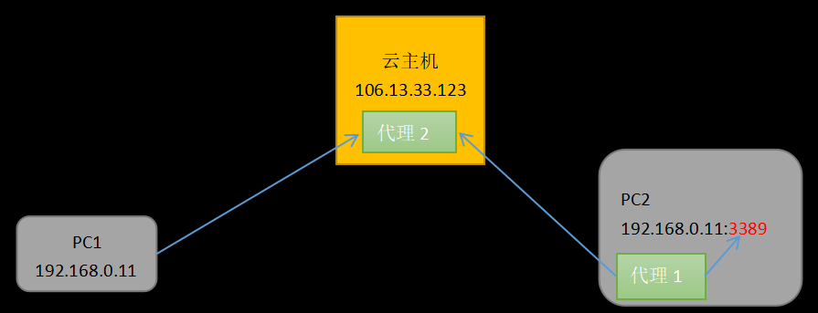

# 一个远程桌面代理
```
这是一个用go写的远程桌面代理, 你可以部署它, 然后在任何地方远程访问你的电脑; 代码只有500行;

疫情期间, 很多同学被困, 无法办公, 如果有一个远程桌面代理, 只要让办公室的同事帮忙启动一下代理, 就可以用家里的电脑远程连接公司的电脑进行办公了;

它的成本非常低, 以百度云为例, 一个月 10 块钱, 3个人合用, 每个人只需要 3元钱;
```

# 原理
* 如下图所示, PC1 和 PC2 各自在局域网的路由器下面, 没有公网 IP, 所以 PC1 无法访问 PC2;

* 需要一个公网的云主机作为代理, 连接 PC1 和 PC2 如下图所示;

```
代理1 运行在 PC2, 连接PC2的 3389 端口, 将数据转发到云主机, 将 代理2 和 本机3389 端口之间的数据进行中转;
代理2 运行在云主机, 接受 PC1 的远程桌面连接请求, 接受 PC2 上 代理1 的请求, 将他们之间的数据进行中转;
```

# 使用
## 1. 租一台云主机, 有一个公网的IP;
## 2. 编译
```
go语言编译很简单, 就不提供步骤了;
```
## 3. 运行
* 注意: 我们假设 "106.13.33.123" 是云主机公网的IP, "172.16.33.123" 是云主机本机的IP; 假设编译出来的程序名字是 main(Linux), main.exe(Windows)
```
在云主机运行:
nohup ./main -log_dir="./log" -v=10 -alsologtostderr=true -st="ss" -s1="172.16.33.123:3399" -s2="172.16.33.123:52201" &
在 PC2 上运行:
start .\main.exe -log_dir="./log" -v=10 -alsologtostderr=true -st="cc" -s1="127.0.0.1:3389" -s2="106.13.33.123:52201"
```
* 注意: 
```
云主机上的代理开放本机的 52201 和 3390 端口, 52201 端口供 代理1 连接, 3390 端口供 PC1 连接;
```
```
PC2 上的代理连接的是云主机的 52201 端口和本机的 3389 端口;
```
## 4 OK, 您可以在任何联网的环境远程连接您的电脑进行远程办公, 例如;
* 在 PC1 上用远程桌面连接 106.13.33.123:3390
* 在 手机上用微软的远程桌面app 连接 106.13.33.123:3390
* 在 iPad上用微软的远程桌面app 连接 106.13.33.123:3390

